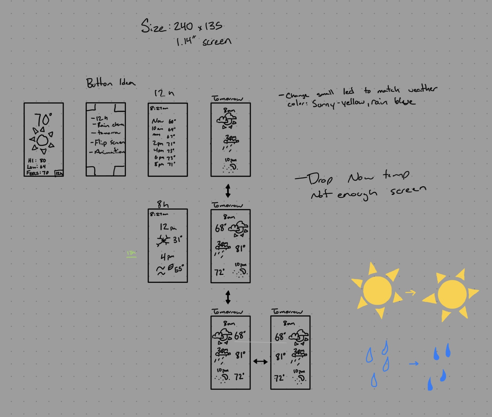
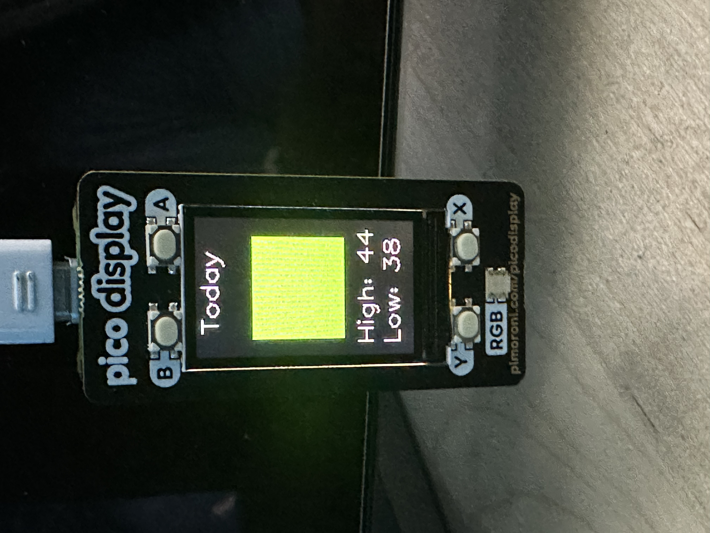

📡 Pico W Weather Widget

This project started as a vision for a tiny, keychain‑style gadget. I repurposed an old 1.14” Pimoroni Display Pack and turned it into a plug‑and‑play weather dongle. The device fetches local weather through the OpenWeather API and displays it across a multi‑screen, 8‑bit‑styled UI built in MicroPython. I even planned animated weather GIFs before running into some fun microcontroller limitations. It’s a compact, creative build that came from pushing small hardware to do something useful.

🌤️ Features
✔ Live Current Weather
Temperature

Feels like

Wind speed

Condition

City name

✔ Multi‑Screen UI
Current Weather Screen

8‑Hour Outlook (time labels adjust dynamically)

Today Screen (High/Low + Icon Placeholder)

✔ Clean Visual Layout
Pixel‑based typography

Icon placeholders are represted as the colored blocks for future PNG support

Consistent spacing and alignment

Designed for a 240x135 display

✔ Robust Error Handling
Fallback values when API fails

Safe rendering even without Wi‑Fi

Graceful screen updates

📸 Photos of Planning & Setup

☀️ Weather Animation Gif

🧠 What I Learned

A refresher in writing clean, readable Python

Calling APIs and integrating live data into embedded code

Illustrating simple pixel art for tiny displays

Navigating limited RAM and CPU while still trying to build a smooth UI

Managing display refresh timing to keep screens responsive without overloading the device

Running into MicroPython’s quirks with PNG decoding and understanding how firmware differences impact image support

API Integration
Fetching and parsing JSON on a microcontroller

Handling network errors and timeouts

Designing around API limitations (e.g., current vs. hourly data)

UI/UX for Tiny Screens
Designing readable layouts at small resolutions

Creating a multi‑screen navigation system

Balancing clarity with minimalism

Engineering Tradeoffs
When to simplify features

When to cut unreliable functionality

How to ship a stable, polished version

⚠️ Technical Challenges
PNG Decoding
MicroPython builds vary in PNG support, and decoding was inconsistent across firmware versions.
Result: PNG icons were deferred for a future update.

Hourly Forecast Limitations
The Pico W lacks an RTC, making timestamp alignment for hourly forecasts unreliable without NTP sync.
Result: The 8‑hour screen uses dynamic time labels but placeholder temps.

Tomorrow Forecast
The One Call API requires precise timestamp matching and timezone handling.
Without a real clock, tomorrow’s hourly temps were inconsistent.
Result: Replaced with a stable “Today High/Low” screen.

Animation Screen
Memory and PNG decoding limitations made animation impractical in MicroPython.
Result: Feature deferred for a future CircuitPython version.

These challenges are part of the learning experience and are documented transparently.

🛠️ Hardware Used
Raspberry Pi Pico W

Pimoroni Display Pack (240×135 IPS)

MicroPython firmware

Wi‑Fi connection

📦 Software & Libraries
MicroPython

urequests for HTTP

time module

Pimoroni Display Pack drivers

🚀 Future Improvement Ideas
Add PNG icons once firmware supports stable decoding

Add NTP time sync for accurate hourly forecasts

Add animation screen using CircuitPython

Add color themes and transitions
